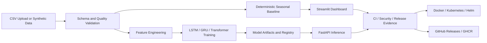
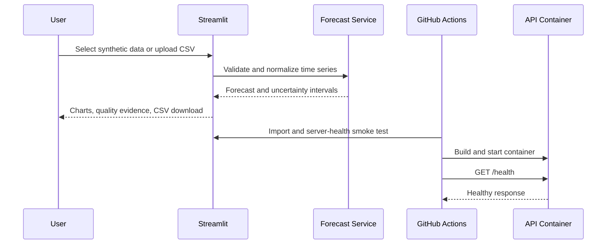
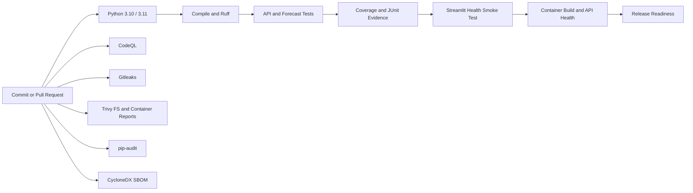

# ⚡ Energy Demand Forecasting — DevMLOps

### Production-oriented time-series forecasting, model serving, Streamlit analytics, and nine-tier deployment hygiene

[](https://github.com/CoreyLeath-code/Energy-Demand-Forecasting-DevMLOps/actions/workflows/ci.yml)
[](https://github.com/CoreyLeath-code/Energy-Demand-Forecasting-DevMLOps/actions/workflows/security.yml)
[](https://github.com/CoreyLeath-code/Energy-Demand-Forecasting-DevMLOps/actions/workflows/release.yml)


[](LICENSE)

---

## Executive Summary

**Energy Demand Forecasting — DevMLOps** is a portfolio-scale AI and MLOps platform for exploring hourly energy-demand forecasting across the full software lifecycle:

- validated data ingestion and time-series preparation;
- deterministic baseline forecasting;
- LSTM, GRU, and Transformer model architectures;
- experiment tracking and model artifacts;
- FastAPI inference with health and metrics endpoints;
- an artifact-independent Streamlit dashboard;
- Docker, Kubernetes, Helm, Terraform, Ansible, and monitoring foundations;
- CI/CD, security automation, SBOM generation, release engineering, and operational governance.

The repository is designed to demonstrate engineering breadth without hiding implementation limitations. The public Streamlit application uses a transparent **seasonal-naive baseline** so it can run without private data, model checkpoints, or GPU dependencies. The full training pathway remains available for deeper model experiments.

> **Portfolio scope:** This repository demonstrates production-oriented engineering patterns. It is not a utility-grade forecasting system, a substitute for grid-operator validation, or a commercial service-level guarantee.

---

## Key Capabilities

### Interactive forecasting

- Reproducible synthetic hourly demand data.
- User-uploaded CSV support.
- Selectable timestamp and demand columns.
- Schema, timestamp, numeric, non-negative, duplicate, and history validation.
- Multi-horizon forecasts from 1 to 168 hours.
- Seasonal-naive baseline with bounded trend adjustment.
- Prediction intervals derived from historical seasonal residuals.
- Forecast-table inspection and CSV download.

### Machine-learning architecture

- LSTM forecasting.
- GRU forecasting.
- Transformer encoder forecasting.
- Config-driven architecture selection.
- GPU → MPS → CPU device resolution.
- Lazy model-artifact loading.
- Explicit trained-model versus deterministic-baseline provenance.

### API and observability

- FastAPI request and response contracts.
- Bounded Pydantic inputs.
- `/health` liveness and model-artifact metadata.
- `/metrics` Prometheus endpoint.
- Controlled service errors.
- Request, error, and latency instrumentation.

### Delivery and security

- Python 3.10 and 3.11 test matrix.
- Ruff correctness gates.
- Coverage XML and JUnit artifacts.
- Streamlit deployment smoke testing.
- Multi-stage non-root API container.
- Live container health validation.
- CodeQL, Gitleaks, Trivy, `pip-audit`, Dependabot, and CycloneDX SBOM generation.
- Semantic tag-driven GitHub Releases and GHCR publishing.

---

## Architecture



### Request and deployment flow



---

## Streamlit Community Cloud

The public dashboard is designed to deploy without private data, checkpoints, scalers, API keys, or external services.

Use these settings after the feature is merged:

```text
Repository:
CoreyLeath-code/Energy-Demand-Forecasting-DevMLOps

Branch:
main

Main file path:
streamlit_demo/app.py
```

The dedicated deployment directory uses a lightweight dependency set instead of installing the full PyTorch, MLflow, XGBoost, and training environment.

Detailed deployment and troubleshooting instructions are available in [`docs/STREAMLIT_DEPLOYMENT.md`](docs/STREAMLIT_DEPLOYMENT.md).

### Run the dashboard locally

```bash
python -m venv .venv
source .venv/bin/activate
python -m pip install --upgrade pip
pip install -r streamlit_demo/requirements.txt
streamlit run streamlit_demo/app.py
```

Open:

```text
http://localhost:8501
```

---

## FastAPI Service

### Install the slim API runtime

```bash
python -m venv .venv
source .venv/bin/activate
python -m pip install --upgrade pip
pip install -r requirements-api.txt
```

### Start the service

```bash
uvicorn src.serve.app:app --reload --host 0.0.0.0 --port 8000
```

OpenAPI documentation:

```text
http://localhost:8000/docs
```

### Endpoints

| Method | Endpoint | Purpose |
|---|---|---|
| `GET` | `/` | Service identity and version |
| `GET` | `/health` | Liveness and optional model-artifact status |
| `GET` | `/metrics` | Prometheus metrics |
| `POST` | `/predict` | Validated demand prediction with backend provenance |

### Example request

```bash
curl -X POST http://localhost:8000/predict \
  -H "Content-Type: application/json" \
  -d '{
    "load_ma_3h": 1234.5,
    "temperature_ma_3h": 22.1
  }'
```

Example response without a mounted trained model:

```json
{
  "predicted_load": 1239.75,
  "backend": "deterministic-baseline",
  "model_version": "1.1.0"
}
```

When `MODEL_PATH` points to a compatible serialized estimator, the API returns:

```json
{
  "predicted_load": 1250.3,
  "backend": "trained-model",
  "model_version": "1.1.0"
}
```

The response always identifies the inference backend. The deterministic fallback is intentionally transparent and is not presented as trained-model output.

---

## Docker

Build the API image:

```bash
docker build -t energy-demand-forecasting:local .
```

Run it:

```bash
docker run --rm -p 8000:8000 energy-demand-forecasting:local
```

Verify health:

```bash
curl http://localhost:8000/health
```

The image uses:

- an isolated dependency-builder stage;
- a minimal Python runtime stage;
- a non-root user with UID `10001`;
- an explicit Uvicorn entry point;
- a built-in health check;
- runtime-mounted model artifacts rather than embedding private checkpoints in the image.

---

## Full Training Environment

Install the complete local training and MLOps stack:

```bash
python -m venv .venv
source .venv/bin/activate
python -m pip install --upgrade pip
pip install -r requirements.txt
```

The full environment includes:

- PyTorch;
- Pandas and NumPy;
- scikit-learn;
- XGBoost;
- Matplotlib and Seaborn;
- Streamlit;
- MLflow;
- API runtime dependencies.

GPU deployments should install the appropriate CUDA-specific PyTorch build for the target environment rather than relying on the default CPU-compatible wheel.

---

## Data Contract

The lightweight forecasting service expects logically equivalent fields for:

| Field | Requirement |
|---|---|
| Timestamp | Parseable date/time value |
| Demand | Non-negative numeric energy-demand value |
| History | At least 48 valid observations |
| Seasonality | At least two full selected seasonal periods |

Normalization behavior:

1. Parse timestamps.
2. Convert demand to numeric.
3. Remove rows with invalid timestamps or demand values.
4. Reject negative demand.
5. Aggregate duplicate timestamps using the mean.
6. Sort observations chronologically.
7. Return canonical `timestamp` and `demand` columns.

The Streamlit app exposes these checks as visible data-quality evidence.

---

## Deterministic Baseline Forecast

The public dashboard uses a seasonal-naive forecast because it is:

- transparent;
- deterministic;
- inexpensive to run;
- independent of external model artifacts;
- appropriate as a baseline for evaluating more complex models.

The algorithm:

1. Repeats the most recent seasonal pattern.
2. Estimates the mean shift from the previous seasonal period.
3. Bounds the trend adjustment to reduce unstable extrapolation.
4. Estimates uncertainty from historical seasonal residuals.
5. Produces point forecasts plus lower and upper intervals.

This baseline should be compared against trained models using time-aware backtesting before any operational use.

---

## Testing

Install CI dependencies:

```bash
pip install -r requirements-dev.txt
```

Run the API and forecasting suite:

```bash
pytest tests/test_api.py tests/test_forecasting.py -v
```

Run with coverage:

```bash
pytest tests/test_api.py tests/test_forecasting.py -v \
  --cov=src.serve \
  --cov=src.forecasting \
  --cov-report=term-missing \
  --cov-report=html
```

Run correctness and syntax checks:

```bash
ruff check src/serve src/forecasting.py tests/test_api.py tests/test_forecasting.py streamlit_app.py streamlit_demo/app.py \
  --select E9,F63,F7,F82

python -m compileall -q src tests streamlit_app.py streamlit_demo/app.py
```

Current automated coverage includes:

- API identity and health contracts;
- optional model-artifact state;
- deterministic fallback inference;
- trained-model inference through a mock estimator;
- bounded input validation;
- invalid model output handling;
- Prometheus metrics;
- deterministic synthetic data;
- timestamp sorting and duplicate aggregation;
- missing-column and negative-demand rejection;
- forecast shape, bounds, intervals, and reproducibility;
- insufficient-history and invalid-horizon failures.

---

## CI/CD and Release Pipeline



Release tags matching `vMAJOR.MINOR.PATCH` trigger:

- generated GitHub Release notes;
- a source archive excluding local data and model artifacts;
- GHCR container publishing;
- container metadata, provenance, and SBOM generation.

---

## L6 Nine-Tier Deployment Hygiene

| Tier | Engineering domain | Automated or documented evidence |
|---|---|---|
| 1 | Source hygiene | Typed contracts, reproducible manifests, compile and Ruff checks |
| 2 | Test engineering | API, forecast, edge-case, failure-mode, coverage, and JUnit evidence |
| 3 | Static quality | CodeQL, syntax validation, bounded schemas, config validation |
| 4 | Security engineering | Gitleaks, Trivy reports, non-root runtime, disclosure process |
| 5 | Supply-chain hygiene | Dependabot, `pip-audit`, CycloneDX SBOM, version pins |
| 6 | Reproducible runtime | Multi-stage container, Python pin, slim API and Streamlit manifests |
| 7 | Continuous delivery | Python matrix, Streamlit health, container health, readiness contract |
| 8 | Release engineering | Semantic tags, GitHub Releases, GHCR, provenance, release SBOM |
| 9 | Operational governance | Health, metrics, changelog, contribution, deployment, rollback standards |

The full control model and promotion standard are documented in [`docs/L6_DEPLOYMENT_HYGIENE.md`](docs/L6_DEPLOYMENT_HYGIENE.md).

---

## Repository Structure

```text
Energy-Demand-Forecasting-DevMLOps/
├── .github/
│   ├── workflows/
│   │   ├── ci.yml
│   │   ├── security.yml
│   │   └── release.yml
│   └── dependabot.yml
├── .streamlit/
│   └── config.toml
├── config/
│   └── config.yaml
├── docs/
│   ├── L6_DEPLOYMENT_HYGIENE.md
│   └── STREAMLIT_DEPLOYMENT.md
├── src/
│   ├── forecasting.py
│   ├── model.py
│   ├── predict.py
│   ├── data_loader.py
│   ├── data_preprocess.py
│   └── serve/
│       └── app.py
├── streamlit_demo/
│   ├── app.py
│   └── requirements.txt
├── tests/
│   ├── test_api.py
│   ├── test_forecasting.py
│   ├── test_metrics.py
│   └── test_preprocess.py
├── Dockerfile
├── requirements-api.txt
├── requirements-dev.txt
├── requirements.txt
├── streamlit_app.py
├── SECURITY.md
├── CONTRIBUTING.md
├── CHANGELOG.md
└── LICENSE
```

The repository also includes Kubernetes, Helm, Terraform, Ansible, Airflow, DVC, MLflow, Prometheus, and Grafana foundations for broader DevMLOps experimentation.

---

## Security and Supply Chain

Security controls include:

- CodeQL analysis;
- Gitleaks secret detection;
- Trivy filesystem reports;
- Trivy API-container reports;
- deployment dependency audits;
- Dependabot updates;
- CycloneDX repository SBOMs;
- GHCR image provenance and SBOM output;
- non-root containers;
- explicit secret-handling guidance.

Report vulnerabilities according to [`SECURITY.md`](SECURITY.md). Do not open public issues containing credentials, private datasets, exploit details, or sensitive infrastructure information.

---

## Operational Limitations

Current constraints are documented intentionally:

- The public Streamlit forecast is a deterministic baseline, not a trained production model.
- Synthetic data is generated for demonstration and does not represent a real utility, market, region, or customer.
- Prediction intervals are empirical baseline intervals, not calibrated probabilistic guarantees.
- The FastAPI fallback preserves service availability but should not be confused with registered-model output.
- Deep-learning performance depends on dataset quality, leakage controls, backtesting design, feature stability, and deployment hardware.
- Infrastructure manifests are reference implementations and require environment-specific configuration, secrets, policies, and capacity planning.

---

## Roadmap

- Time-aware cross-validation and rolling-origin evaluation.
- Baseline-versus-model comparison dashboard.
- Probabilistic forecasting and calibrated prediction intervals.
- Model registry promotion policy.
- Feature and prediction drift monitoring.
- OpenTelemetry traces across training and serving.
- Authenticated and versioned inference endpoints.
- Batch prediction jobs and asynchronous processing.
- Streamlit model-comparison and explainability views.
- Automated model-card and data-card generation.
- SLSA-aligned build provenance and signed release artifacts.

---

## Engineering Principles

The project prioritizes:

- correctness before complexity;
- reproducibility before optimization;
- explicit provenance over hidden fallbacks;
- visible validation over silent coercion;
- automation for repeatable quality gates;
- security throughout the development lifecycle;
- lightweight public demonstrations separated from heavyweight training environments;
- documentation of limitations, tradeoffs, and recovery paths.

---

## Author

**Corey Leath**  
Software Development and AI Engineering portfolio

GitHub: [CoreyLeath-code](https://github.com/CoreyLeath-code)

---

## License

This project is licensed under the [MIT License](LICENSE).
